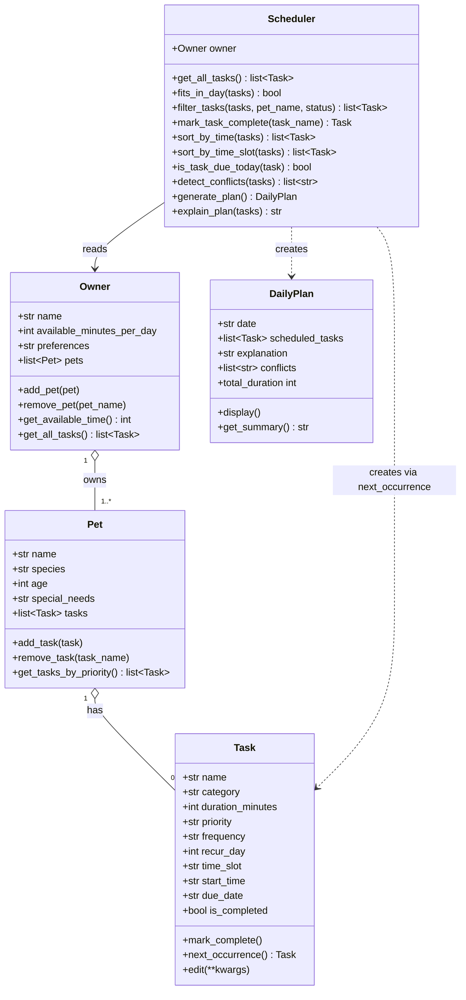

# PawPal+ Final UML Diagram

```mermaid
classDiagram
    class Task {
        +str name
        +str category
        +int duration_minutes
        +str priority
        +str frequency
        +int recur_day
        +str time_slot
        +str start_time
        +str due_date
        +bool is_completed
        +mark_complete()
        +next_occurrence() Task
        +edit(**kwargs)
    }

    class Pet {
        +str name
        +str species
        +int age
        +str special_needs
        +list~Task~ tasks
        +add_task(task)
        +remove_task(task_name)
        +get_tasks_by_priority() list~Task~
    }

    class Owner {
        +str name
        +int available_minutes_per_day
        +str preferences
        +list~Pet~ pets
        +add_pet(pet)
        +remove_pet(pet_name)
        +get_available_time() int
        +get_all_tasks() list~Task~
    }

    class Scheduler {
        +Owner owner
        +get_all_tasks() list~Task~
        +fits_in_day(tasks) bool
        +filter_tasks(tasks, pet_name, status) list~Task~
        +mark_task_complete(task_name) Task
        +sort_by_time(tasks) list~Task~
        +sort_by_time_slot(tasks) list~Task~
        +is_task_due_today(task) bool
        +detect_conflicts(tasks) list~str~
        +generate_plan() DailyPlan
        +explain_plan(tasks) str
    }

    class DailyPlan {
        +str date
        +list~Task~ scheduled_tasks
        +str explanation
        +list~str~ conflicts
        +total_duration int
        +display()
        +get_summary() str
    }

    Owner "1" o-- "1..*" Pet : owns
    Pet "1" o-- "0..*" Task : has
    Scheduler --> Owner : reads
    Scheduler ..> DailyPlan : creates
    Scheduler ..> Task : creates via next_occurrence
```
